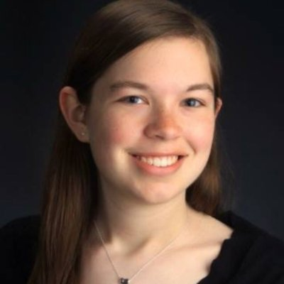

This website comes from a collaborative research project of five dedicated, industrious, and creative students in a History course at the University of Michigan, _The Digital Futures of History_. This course set out to examine how forms of history, historical knowledge production, historical awareness and meaning are shaped by a digital medium.

## Accessible

- All our content is written in [Markdown](https://daringfireball.net/projects/markdown/syntax) with plain text files.
- The site is hosted at [GitHub Pages](https://github.com/umich-hist-399/campus-histories);
- We use a few Google Sheets to manage metadata.

## Our Team
<!--

**Sarah Henzlik** is a junior in the College of Literature, Science and the Arts majoring in Communication Studies with a minor in the History of Art. Originally from the Chicago area, she is interested in ways of conveying complex histories in accessible ways, particularly on mobile platforms.
-->

<!-- Our extensive bibliography can be found on our bibliography page; most historical material came from the [Bentley Historical Library](http://bentley.umich.edu/).
-->
