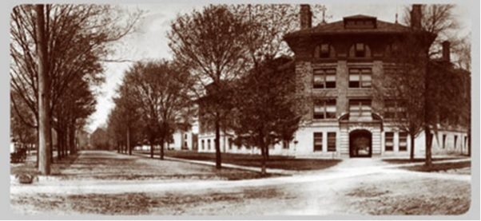



This year, the University of Michigan celebrates its Bicentennial; the 200th anniversary of its founding. Founded in Detroit, Michigan in 1817, the university moved its operations to Ann Arbor, Michigan twenty years later (“UM History”). While today the University is well-known for its sprawling campus—complete with a Central Campus for primary academic activities, a North Campus for supplemental academic programs such as the College of Engineering and the School of Music, Theatre and Dance, a Medical Campus and a South Campus for Wolverine athletic pursuits—the University was not always as expansive; in fact, in the year of its founding in Ann Arbor, the University originally occupied forty acres of land in the recently incorporated city of Ann Arbor (“UM History”).

On a donation by the Ann Arbor Land Company, the University consisted of four homes for faculty and one building that operated as a classroom and dormitory. The surrounding area, known today as the [‘Diag’](https://umich-hist-399.github.io/campus-histories/essays/diag), lay undeveloped with grazing cows (“UM History”). This iteration did not remain long; soon the University embarked on what would become almost 200 years of expansion in terms of physical and academic inquiry and innovation (“UM History”). The following essay focuses on the University’s expansion east. As Don Callard of _The Ann Arbor Observer_ notes, “nothing expands like a university,” (Callard 2009).

{% include figure.html class="img-center" width="75%" src="/images/maps1.jpg" caption="At left: Map of Ann Arbor (1854); at right: Map of Ann Arbor (1864)" %}

In an early city map from 1854, the University, designated as ‘Michigan State University’ reveals the first building on the ‘East Side’ of the Ann Arbor campus: a medical building built in 1850 on a road called ‘University Square East’; the nomenclature of the street name is significant—over the years, the streets on the eastern boundary of campus have taken on a number of different names. On a map made 10 years later, the designer indicates that the original medical building now features an addition, a laboratory, and is referred to as ‘Medical College.’ On this map, the eastern street is not named. Despite this, we can see the emergence of the present-day Church Street and the now-defunct College Street. College Street, along with many other streets such as Haven Avenue and Belser Street, have now become walkways and sidewalks connecting the campus (Callard 2009).

Eastern boundary development stunts for almost twenty years. The University features no additional buildings, only the nomenclature of the street changes—‘University Street’ (1866); ‘East University Avenue’ (1874).

While up until this point, this history has focused on University property, it is important to note that an important aspect of student life also occurs off campus. One such location, ‘the Campus Club’, also known as ‘Prettyman’s Boarding House’, was a mainstay eatery, source of employment and housing for almost thirty years (1885-1914) (The Michigan Alumnus, November 12, 1938, p. 101). Owned and operated by University alumnus and football team captain Horace Prettyman, the house served as an unofficial social hall for students and was regarded as a campus landmark, one of the ‘largest and the most popular of Ann Arbor's boarding houses in the days when the **vast majority of the student body used this type of service for their meals.’** (The Michigan Alumnus, November 12, 1938, p. 101).

 {% include figure.html class="img-center" width="50%" src="/images/campus-map-prettymans.jpg" caption="Campus map featuring advertisement for the 'Campus Club' with H.G. Prettyman listed as the proprietor, date unknown" %}

Revered University of Michigan Football Coach Fielding Yost even kept a ‘training table’ for his players to eat at (The Michigan Alumnus, 45:101). However, as a letter in The Michigan Alumnus of 1938 notes, Prettyman’s “has been altered and remodeled, as have so many structures, which have been in the path of University progress”, further noting that “‘Freeman's’ [another Ann Arbor eating club] held the fort as the last survivor until it met the same nemesis that "Prett's" is now experiencing - the expansion of the University,” (The Michigan Alumnus, 45: 101). 



It should be noted that Freeman’s was torn down to make way for the [Rackham School of Graduate Studies](https://umich-hist-399.github.io/campus-histories/blurbs/rackham-school) (The Michigan Alumnus, 45: 101). It is clear already that residents and administrative faculty did not always see eye to eye. While the University purchased the home in 1914 to serve as housing for nurses, hospital ward helpers and female students, it was torn down in 1938 to make way for the now present [School of Dentistry](https://umich-hist-399.github.io/campus-histories/summaries/dentalschool) on the northeast boundary of the original campus, becoming, as the maligned author notes, yet “another Campus landmark [that is] just a memory,” (The Michigan Alumnus, 45: 101).

By the last decade of the nineteenth century, it is clear that the University is set on expanding its campus to accommodate the interests of its students and faculty, what Perry and Weiwel (2005) would term “internal logic.”

 {% include figure.html class="img-center" width="50%" src="/images/1890-map-blue-highlighted.jpg" caption="With the help of computer software, buildings from this 1890 map of Ann Arbor pop out when highlighted in blue" %}

In the map above, from 1890, the University has [acquired or constructed many buildings](https://umich-hist-399.github.io/campus-histories/essays/acq-public-schools). One building, Tappan School, former elementary school that was condemned as a fire hazard by the state fire inspector in 1922, was purchased by the University the next year and became present day East Hall, seen below (‘Tappan School’).

 {% include figure.html class="img-center" width="50%" src="/images/tappan-school-diag.jpg" caption="View of The Diag from nearby Tappan School" %}

Further development on the Diag included the Heating Plant (1883) and the ‘Boiler House’ (1894), built to provide heating for rapidly increasing number of buildings on campus (‘1883 Heating Plant and 1894 Boiler House’). Another plant built on Washington Street in 1911 rendered it no longer needed. The latter unsightly smokestack was disliked by faculty for its aesthetics in the midst of the green space Diag (‘1883 Heating Plant and 1894 Boiler House’).

 {% include figure.html class="img-center" width="33%" src="/images/smokestack1.jpg" caption="Smokestack near the 'Boiler House' circa 1894." %}

Mortimer Cooley, Dean of Engineering was quoted to have said “I thought if I could make the boiler house as ugly as possible, and fix the guy ropes so some of the professors would get their heads bumped, I might get some help. Suffice to say, the following year I was authorized to make plans for the present boiler house in the old ‘Cat Hole’.” (Scientific Blacksmith, p. 82). The space was subsequently converted into an engineering lab and later an ROTC building in 1925, being used until 1942 (‘1883 Heating Plant and 1894 Boiler House’).



Despite the recession of the tail end of the ninteenth century, the University continued to expand its infrastructure in the early twentieth century, particularly to the east. Notable additions include a number of medical buildings to the northeast—a homeopathic hospital, Palmer Ward & Nurses Residence, an Allopathy Hospital, an Ophthalmology & Otology facility and a Psychopathic Ward—the University [‘Detroit Observatory’](https://umich-hist-399.github.io/campus-histories/essays/detroit-observatory) (1854) and its adjacent student observatory and residence, the [Waterman Gymnasium](https://umich-hist-399.github.io/campus-histories/summaries/watermangymnasium) (1894) which was used for a variety of student activities such as exercise classes, class registration, a dance hall, a space for fundraising banquets and a space for barrack-like training for WWI soldiers (Crawford 1976; Wear 1950).

 

    
    
The twentieth century brought even more expansion of the University to the East.

  

  

    
    
A plan of the Detroit Observatory from the 1970s.

  

  

    
Exterior of Waterman Gymnasium.

  

  

    
Female students participate in exercise classes.

  

  

    
‘J-Hop’ dance participants pose in the Block M formation.

  

Another significant addition was the ‘New Engineering Building’ (1903), renamed ‘West Engineering’ (‘New Engineering Building’). As the Diag as a thoroughfare was already a mainstay, this building had to be designed in order to not interfere “with the diagonal walk of the campus”. Thus, Professor Charles Denison “prepared a sketch showing the diagonal walk passing through an archway in the building. The Arch was named the Denison Archway in his honor. In later years it was referred to as the “Engineering Arch,” (as quoted in ‘New Engineering Building’)

The Arch was and still is a campus landmark, [with growing lore](https://umich-hist-399.github.io/campus-histories/blurbs/arch) attached to it and activities that occur near it.

  

    
    
View of Arch from Southwest.

  

  

    
View of Arch from Northeast.

  

  

    
Students walk through ‘The Arch' regarded as a 'A Symbol of The College of Engineering’.

  

  

    
View of Diag from Engineering Arch.

  
 
  

    
 The Engineering Arch in 1921.

  

  

    
The Engineering Arch today.

  

The University's expansion to the east offers a case study in the growing pains and benefits of time. By analyzing the University's trajectory via urban planning, we can see how needs of individuals are reflected in the architecture and vice versa.

## Sources

- ‘‘1883 Heating Plant and 1894 Boiler House’
[http://umhistory.dc.umich.edu/mort/original/1900/18%20-Boiler%20House%20(1894)/index.html](http://umhistory.dc.umich.edu/mort/original/1900/18%20-Boiler%20House%20(1894)/index.html)

- Angell, J. Burrill. Farewell address of President James Burrill Angell to the undergraduate students of the University of Michigan, Waterman gymnasium, May the twenty-eighth, 1909. [Ann Arbor, Mich.: Ann Arbor Press].

- Callard, Don. The Lost Street Names of Ann Arbor. _The Ann Arbor Observer_, July 24, 2009.
[http://aaobserver.aadl.org/aaobserver/19282](http://aaobserver.aadl.org/aaobserver/19282)

- Crawford, Pamela. Detroit Observatory : architectural design project. University of Michigan, College of Architecture and Urban Planning, 1976.

- ‘New Engineering Building’
[http://umhistory.dc.umich.edu/mort/original/1925/15%20West%20Engineering%20Building/index.html](http://umhistory.dc.umich.edu/mort/original/1925/15%20West%20Engineering%20Building/index.html)

- Perry, David, and Wim Wiewel. From campus to city: the university as developer. New York: Routledge, 2005.

- “Famous Campus Landmark Disappears.” The Michigan Alumnus, vol. 45 (November 12, 1938),  pp. 101
Accessed via: [http://um2017.org/Ann-Arbor/Ann_Arbor_Maps/Prettymans_Boarding_Club.html](http://um2017.org/Ann-Arbor/Ann_Arbor_Maps/Prettymans_Boarding_Club.html)

- Berry, Margaret D. “A History of Tappan Junior High School.” 1954.
	
- ‘The Detroit Observatory’
[http://umhistory.dc.umich.edu/mort/central/Observatory%20Street/Observatory/index.html](http://umhistory.dc.umich.edu/mort/central/Observatory%20Street/Observatory/index.html)

- ‘Waterman Gymnasiums’
[http://umhistory.dc.umich.edu/mort/original/1900/19%20Waterman%20Gymnasium/index.html](http://umhistory.dc.umich.edu/mort/original/1900/19%20Waterman%20Gymnasium/index.html)

- Wear, Robert E. “University of Michigan’s Waterman Gymnasium : development and expansion from 1894 to 1930.”, 1950. Call number 861152 Aa 1

- Wineberg, Susan. The Lost University - The Forgotten Campus of 1900. _The Ann Arbor Observer_, May 27, 2011.
[http://aaobserver.aadl.org/aaobserver/40615](http://aaobserver.aadl.org/aaobserver/40615)

## Image Credits

- 1854 map of Ann Arbor, 1864 map of Ann Arbor: The Ann Arbor Historic Maps Project. University of Michigan Millennium Project. [http://umhistory.org/history/town-gown/](http://umhistory.org/history/town-gown/)

- "Campus map featuring advertisement for the Campus Club..." date unknown. The Bentley Historical Library. University of Michigan.

- 1890 map of Ann Arbor: The Ann Arbor Historic Maps Project. University of Michigan Millennium Project. [http://umhistory.org/history/town-gown/](http://umhistory.org/history/town-gown/)

- "View of The Diag..." William Adams Lewis photograph series. The Bentley Historical Library. University of Michigan.

- "Smokestack near the 'Boiler House'..." '1883 Heating Plant and 1894 Boiler House.' University of Michigan Millennium Project.
[http://umhistory.dc.umich.edu/mort/original/1900/18%20-Boiler%20House%20(1894)/index.html](http://umhistory.dc.umich.edu/mort/original/1900/18%20-Boiler%20House%20(1894)/index.html)

- "The twentieth century brought..." 1904 map of Ann Arbor. The Ann Arbor Historic Maps Project. University of Michigan Millennium Project. [http://umhistory.org/history/town-gown/](http://umhistory.org/history/town-gown/)

- "A plan of the Detroit Observatory..." Crawford, Pamela. Detroit Observatory : architectural design project. University of Michigan, College of Architecture and Urban Planning, 1976.

- "Exterior of Waterman Gymnasium." 'Waterman Gymnasiums.' University of Michigan Milennium Project. [http://umhistory.dc.umich.edu/mort/original/1900/19%20Waterman%20Gymnasium/index.html](http://umhistory.dc.umich.edu/mort/original/1900/19%20Waterman%20Gymnasium/index.html)

- "Female students participate..." 'Waterman Gymnasiums.' University of Michigan Milennium Project. [http://umhistory.dc.umich.edu/mort/original/1900/19%20Waterman%20Gymnasium/index.html](http://umhistory.dc.umich.edu/mort/original/1900/19%20Waterman%20Gymnasium/index.html)

- "'J-Hop' dance participants..." 'Waterman Gymnasiums.' University of Michigan Milennium Project. [http://umhistory.dc.umich.edu/mort/original/1900/19%20Waterman%20Gymnasium/index.html](http://umhistory.dc.umich.edu/mort/original/1900/19%20Waterman%20Gymnasium/index.html)

- "View of the Arch from the Southwest." 'New Engineering Building.' University of Michigan Milennium Project.
[http://umhistory.dc.umich.edu/mort/original/1925/15%20West%20Engineering%20Building/index.html](http://umhistory.dc.umich.edu/mort/original/1925/15%20West%20Engineering%20Building/index.html)

- "View of th Arch from the Northeast." 'New Engineering Building.' University of Michigan Milennium Project.
[http://umhistory.dc.umich.edu/mort/original/1925/15%20West%20Engineering%20Building/index.html](http://umhistory.dc.umich.edu/mort/original/1925/15%20West%20Engineering%20Building/index.html)

- "Students walk through..." 'New Engineering Building.' University of Michigan Milennium Project.
[http://umhistory.dc.umich.edu/mort/original/1925/15%20West%20Engineering%20Building/index.html](http://umhistory.dc.umich.edu/mort/original/1925/15%20West%20Engineering%20Building/index.html)

- "View of Diag from Engineering Arch." Isaac Sheets photograph collection. The Bentley Historical Library. University of Michigan.

- "The Engineering Arch in 1921." The Bentley Historical Library. University of Michigan.

- "The Engineering Arch today." 'West Engineering Building - Revisited.' Michigan Exposures http://michiganexposures.blogspot.com/2011/03/west-engineering-building-revisited.html
