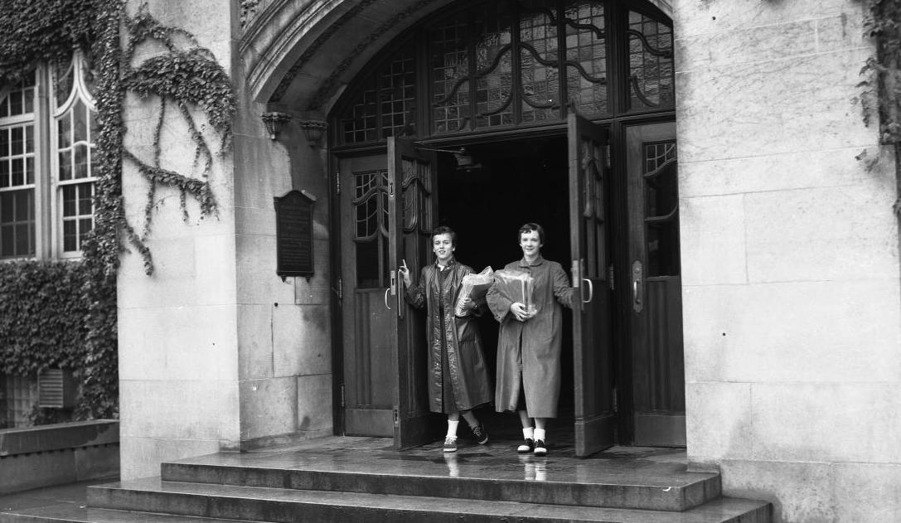
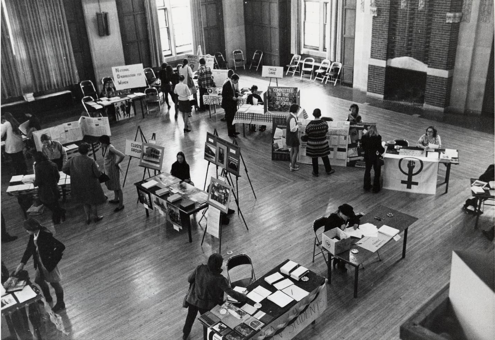
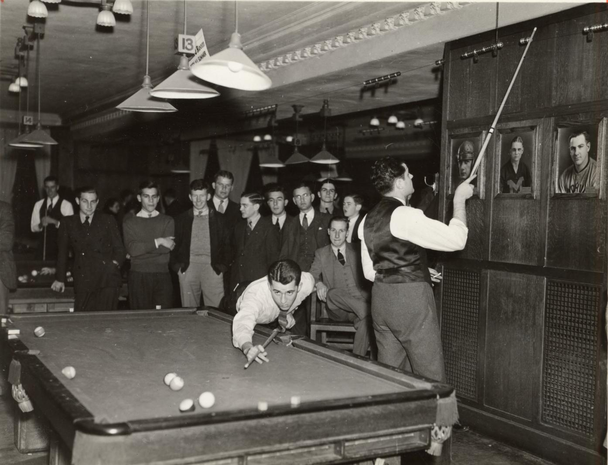



## Humble Beginnings

In 1903, the University of Michigan campus was abuzz with talk of developing a social space for "Michigan Men Everywhere" and the Michigan Union club was formed (Bates 1905, 1). Many of the men in the club were looking to other great institutions and the success of their union clubhouses. In outlining a plan for the Michigan Union in 1905, the officers looked specifically at the Harvard Union and Dartmouth College Club for inspiration (Bates 1905; 8,14). **Thus, their vision for the Union clubhouse at Michigan was one to rival Ivy League opulence and grandeur.** This vision needed a large amount of both time and money, but the officers were anxious to establish a temporary clubhouse on campus until the grand plans could be carried out.

{% include figure.html class="img-center" width="100%" caption="The Thomas Cooley residence before renovations." src="/images/cooley-union.jpg" %}

## The Cooley Years

In 1906, the officers of The Union officially purchased the Thomas Cooley residence, and acquired the temporary union clubhouse on July 1, 1907 ("Cooley Property to be Site of Union Clubhouse" 1906). The house featured two outbuildings and a large amount of empty land that could be developed in the future (Ruger et al. 1890). For the members of the Michigan Union, acquiring the clubhouse was viewed as a great triumph, but there were many difficulties ahead.

The first roadblock that the Michigan Union encountered with the Cooley residence was a lack of funds to remodel the home and make it functional for use as a clubhouse. In January 1907, with the acquisition day in July looming ahead, members were scrambling to get funding for the needed renovations ("Regent Levi L. Barbour has Again Delved into his Purse" January 1907). Without the renovations, the house could not serve as a clubhouse.

Though the members never planned for the Cooley residence to have all of the features they envisioned for the permanent clubhouse, they still held it to the same basic standards that Henry Bates laid out on the first page of his book.

{% include figure.html class="img-left" width="33%" caption="The plans for the Union clearly outlined what the club would not be." src="/images/union-rules.jpg" %}

As luck would have it, Regent Levi L. Barbour was a strong proponent of the the Union, as well as a wealthy man. To keep allow the renovations to begin when the club acquired the house, Barbour donated a piece of property in Detroit to the Union. Members graciously accepted the gift, and auctioned off the property for cash right away ("Regent Levi L. Barbour has Again Delved into his Purse" 1907). For the moment, the Union was back on track.



With renovations underway, the officers of the Union set November 9 as the official opening date of the Cooley house Union clubhouse. A lavish description of the Mission style interior appears in the October 30 edition of the Michigan Daily, and boasts, "Ease and comfort are near at hand for the members of the Michigan Union" ("Cozy Union Home to be Opened Nov. 9" 1907). **This clubhouse only included men fortunate enough to have the ability to afford the membership fee of 3 dollars, which was a lot to pay at the time** (Rowe 2005, 13).

{% include figure.html class="img-center" width="100%" caption="Demolishing the Cooley residence" src="/images/demolish-cooley.jpg" %}

## Membership Troubles and Triumph

Even with the new facility available to members of the Michigan Union, it seems as though only a handful of students were willing to join. Low membership would become a problem if the club could not raise enough money from dues to build the clubhouse they had envisioned. Thus, the Michigan Daily began running campaigns, that they claimed were not endorsed, to convince Michigan men that a membership was worth it ("Meals, Billiards, Tennis for Clubhouse Patrons" 1907). These campaigns were successful; **by 1914, the membership had grown to 2,833 men out of the 4,500 enrolled at the university** ("University of Michigan Union" 1914.) Finally, the opulent clubhouse members had imagined back in 1904, was in view.

In 1914, the Michigan union released plans for its ambitious new club house in a book that launched a nation-wide fundraiser ("University of Michigan Union" 1914). The officers chose the architecture firm Pond & Pond of Chicago to draw plans for the building, who were Michigan grads themselves ("Union Clubhouse Finished by Spring" 1916). With plans in place and funding coming in from Michigan people across the United States and a loan, demolition began. On a warm day in July, the Cooley residence, and the Pond residence were torn down to make way for the new Michigan Union building ("The Old Thomas Cooley Residence" 1916). From this point, it was full steam ahead, but not for long.

{% include figure.html class="img-center" width="100%" caption="Pond's rendering of the Union lobby" src="/images/union-plan.jpg" %}

## World War I

On April 6, 1917 the United States declared war against Germany and thus entered WWI ("HJRes 24" 1917). With the onset of the war, construction of the Union lost steam as there was a shortage of both young men and funds ("Union Building Makes Progress" 1917). Due to a lack of space in other buildings on campus, the unfinished Union was used by the Students’ Army Training Corps to both house and feed men. Ironically, the Navy used the natatorium for a mess hall, while the army used the ballroom ("Students Use New Union Mess Hall" 1918). With the end of the war, the military moved out, but the Union suffered from a lack of funds ("Michigan Union Plans Immediate Completion" 1918).

{% include figure.html class="img-center" width="100%" caption="The temporary Army mess hall set up in the unfinished Union ballroom" src="/images/mess-hall-union.jpg" %}

## Unconventional Fundraising

The war put a damper on fundraising for the Union, and in 1919, the Union officers employed desperate measures. In an effort to shame people into donating, the General Committee of Michigan Union Alumni compiled a list of all those who had not subscribed any money to the building fund. **This was no simple list of names however, it included both the graduating class and address of the members**.



They finished the list in March 1919, and made it public, with the condition that people could get their names removed if they donated to the fund before the list was to be published in June. Thus, as donations rolled in, the list was revised to permanent form, published, and distributed to members on June 1, 1919. It boasted, "Out of 30,000 living members, 18,000 have subscribed nothing." ("Unfinished business" 1919). It may be of note that "The Michigan Daily", which supported the Union, made no report of this interesting fundraiser.

{% include figure.html class="img-center" width="100%" caption="The title page of the list that was distributed to members." src="/images/unfinished-business.jpg" %}

## A Dream Finally Realized

It seems that the shaming was successful, because the Michigan Union opened its doors to members for a housewarming party on November 15, 1919 ("Hogan Welcomes Frosh to Union" 1919). At that point, all Michigan men were free to use the barbershop, restaurant, bowling alley, and many other amenities the Union had to offer. Through the years, the Union has undergone multiple renovations and repurposing to fit the needs of the day, but it has stayed true to its mission to provide a social space on campus (Rowe 2005).



## From "Michigan Men Everywhere" to "Michigan People Everywhere"

**When the Union was first established, it catered mostly to white, wealthy, male students.** This is because it was a men’s club with a membership fee (Rowe 2005). In 1918, a membership fee of 5 dollars a year was included in tuition. Thus, the membership base widely expanded to include all male students ("Union Secretary Explains New Fee" 1918). This was a controversial move however, because students that did not wish to pay for membership were forced to.

In the early days of the Union, women were not allowed membership. Women were allowed in the building, but had to enter through the east entrance with a male escort ("University of Michigan Union" 1914). Slowly, the escort rule became lax, but a doorman stood at the front door until 1942 soley for the purpose of directing women to the east entrance. After the doorman system was eradicated, more and more women began to slip through the front door. In 1954 the Union President made and official statement that women could use the front entrance ("The Front Door Custom, How it Came and Went" 1954). Women were not granted access to the entire building until 1968 however, when the billiards room became open to them (Bordin 1999, 82).

**Today, all Michigan students can enjoy the many facilities that the Union has to offer**. The building is a popular place to study and grab lunch year-round. It is strange to think of the building’s past of unconventional fundraising, pools turned mess halls, and exclusivity while sitting in the food court, surrounded by Michigan’s diverse student population.

  

    
    
Women exiting the front door of the Union before it was allowed.

  

  

    
The Women's Fair at the Union.

  

  

    
Men in the Billiards Room of the Union in 1937.

  

-----

## Sources

- Bates, Henry Moore. _The Plan and Purpose of the Michigan Union._ Ann Arbor: The Richmond & Backus co., 1905.

- Bordin, Ruth Birgitta Anderson. _Women at Michigan: The "dangerous experiment," 1870s to the Present._ Ann Arbor: University of Michigan Press, 1999.

- "Cooley Property to Be Site of Union Clubhouse." _Michigan Daily Digital Archives_, December 11, 1906.

- "Cozy Union Home to Be Opened Nov. 9." _Michigan Daily Digital Archives_, October 30, 1907.

- Hitchcock, Gilber Monell. War with the Imperial German Governmen, Pub. L. No. 65 S.J. Res 1 (1917).

- "Hogan Welcomes Frosh to Union." _Michigan Daily Digital Archives_, October 1, 1919.

- "Meals, Billiards, Tennis for Clubhouse Patrons." _Michigan Daily Digital Archives_, November 12, 1907.

- "Michigan Union Plans Immediate Completion." _Michigan Daily Digital Archives_, November 30, 1918.

- "Regent Levi L. Barbour Has Again Delved into His Purse." _Michigan Daily Digital Archives_, January 24, 1907.

- Rowe, Jeffrey M., and University of Michigan. _The Michigan Union, 1904-2004: 100 Years of Student Life_. 146. Ann Arbor: University of Michigan, 2005.

- Ruger, A., J. J. Stoner, and Beck & Pauli. "Panoramic View of the City of Ann Arbor, Washtenaw Co., Michigan 1880." [Washington, D.C.: Library of Congress, 1998.

- "Students Use New Union Mess Hall." _Michigan Daily Digital Archives_, October 2, 1918.

- "The Front Door Custom, How It Came and Went." _Michigan Daily Digital Archives_, October 30, 1954.

- "The Old Thomas Cooley Residence." _Michigan Daily Digital Archives_, July 25, 1916.

- "Union Building Makes Progress." _Michigan Daily Digital Archives_, June 28, 1917.

- "Union Clubhouse Finished by Spring." _Michigan Daily Digital Archives_, July 22, 1916.

- "Union Secretary Explains New Fee." _Michigan Daily Digital Archives_, October 6, 1918.

- University of Michigan Union. _Unfinished Business: The Michigan Union Building: List of Alumni Who Have Subscribed Nothing_. Ann Arbor, Mich.: General committee of Michigan Union alumni, 1919.

- _University of Michigan Union_. Ann Arbor, Mich.: The Ann Arbor press, 1914.

## Images

- ["Demolishing the Cooley..."](http://quod.lib.umich.edu/b/bhl/x-bl004684/bl004684)

- ["It may be one..."](https://quod.lib.umich.edu/b/bhl/x-hs4559/HS4559?from=index;lasttype=boolean;lastview=thumbnail;med=1;resnum=252;size=20;sort=relevance;start=241;view=entry;rgn1=ic_all;q1=union;evl=undefined;evl=undefined)

- Juxtapose Union photos: [1950](http://quod.lib.umich.edu/b/bhl/x-bl004701/bl004701); 2010: Cbl62. "Michigan Union, Ann Arbor, Michigan." [Wikimedia Commons](https://commons.wikimedia.org), October 2010.

- ["Men in the Billiards Room..."](http://quod.lib.umich.edu/b/bhl/x-hs10279/HS10279?from=index;lasttype=boolean;lastview=thumbnail;med=1;resnum=242;size=20;sort=relevance;start=241;subview=detail;view=entry;rgn1=ic_all;q1=union)

- ["Pond's rendering of..."](https://quod.lib.umich.edu/b/bhl/x-bl004721/BL004721?from=index;lasttype=boolean;lastview=thumbnail;med=1;resnum=68;size=20;sort=relevance;start=61;subview=detail;view=entry;rgn1=ic_all;q1=union)

- "The plans for the Union...": Bates, Henry Moore. _The Plan and Purpose of the Michigan Union._ Ann Arbor: The Richmond & Backus co., 1905.

- ["The temporary Army mess..."](https://quod.lib.umich.edu/b/bhl/x-hs15485/HS15485?from=index;lasttype=boolean;lastview=thumbnail;med=1;resnum=44;size=20;sort=relevance;start=41;view=entry;rgn1=ic_all;q1=union;evl=undefined)

- ["The Thomas Cooley..."](https://quod.lib.umich.edu/b/bhl/x-hs7843/HS7843?from=index;lasttype=boolean;lastview=thumbnail;med=1;resnum=209;size=20;sort=relevance;start=201;view=entry;rgn1=ic_all;q1=union;evl=undefined)

- "The title page of...":University of Michigan Union. _Unfinished Business: The Michigan Union Building: List of Alumni Who Have Subscribed Nothing_. Ann Arbor, Mich.: General committee of Michigan Union alumni, 1919.

- ["The Women's Fair..."](https://quod.lib.umich.edu/b/bhl/x-hs7249/HS7249?from=index;lasttype=boolean;lastview=thumbnail;med=1;resnum=279;size=20;sort=relevance;start=261;view=entry;rgn1=ic_all;q1=union;evl=undefined)

- [Women Exiting the Front...](https://quod.lib.umich.edu/b/bhl/x-hs16367/HS16367?from=index;lasttype=boolean;lastview=thumbnail;med=1;resnum=134;size=20;sort=relevance;start=121;view=entry;rgn1=ic_all;q1=union;evl=undefined)
