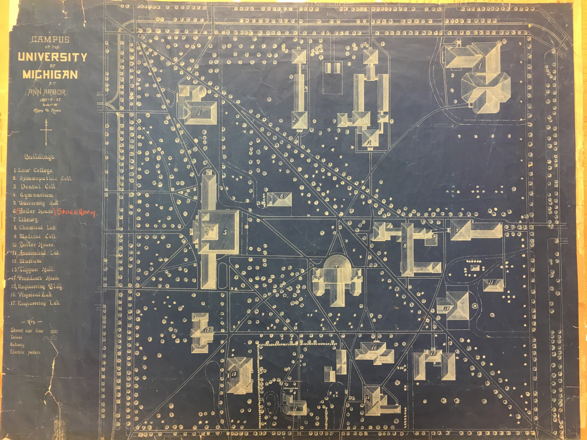
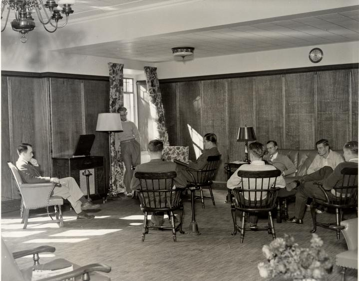



## Our goal
Traditional university and campus histories rightfully celebrate growth, development, expansion, and progress. They enumerate great leaders, new buildings, new departments, and an ever-growing capacity for research, teaching, and learning.

But that is never the whole story. Here we offer a set of neglected but integral stories to campus history. In particular, we focus on people and places displaced by campus expansion---not as a condemnation of "progress" or a romanticization of a past---but to remember the invisible histories of a place that collectively define its identity.

  
  

    <h4 class="card-title">Explore by Space</h4>
    
We've highlighted some important spaces to explore.

    
<a href="map.html" class="btn btn-primary">Go to the Map</a>

  

  
  

    <h4 class="card-title">Explore by Theme</h4>
    
From public schools to the Japanese School to marches on the Diag, we've surveyed a variety of themes.

    <a href="directory-new.html" class="btn btn-primary">Go to the Directory</a>
  

